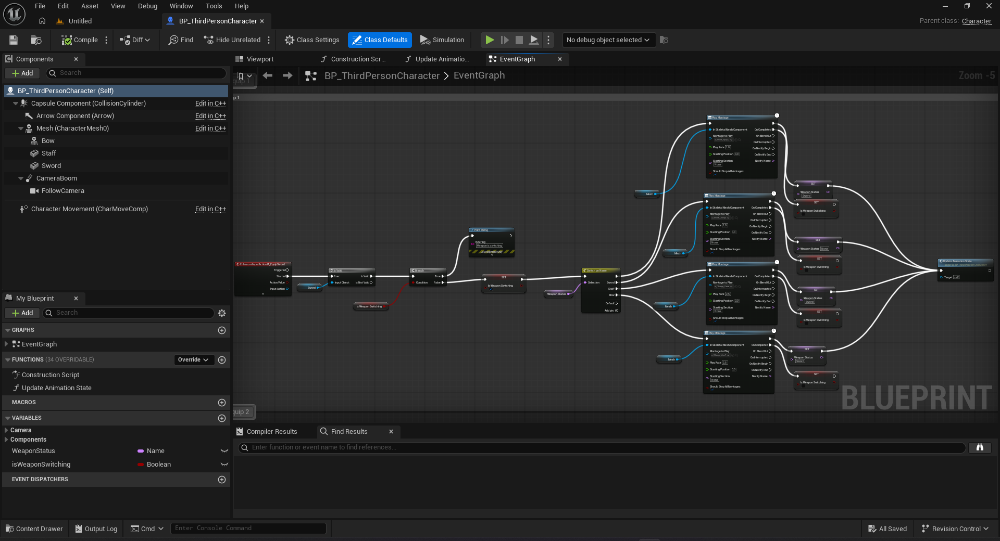
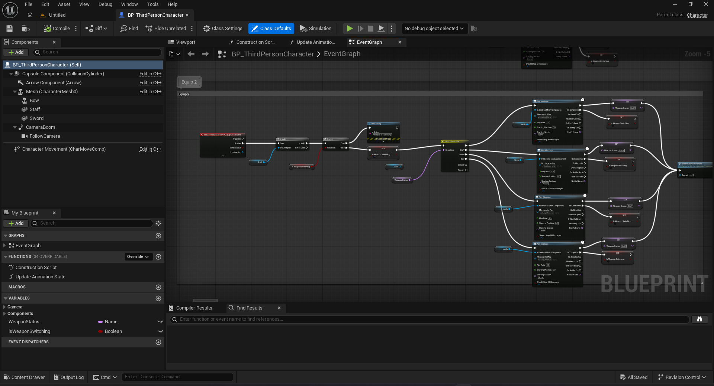
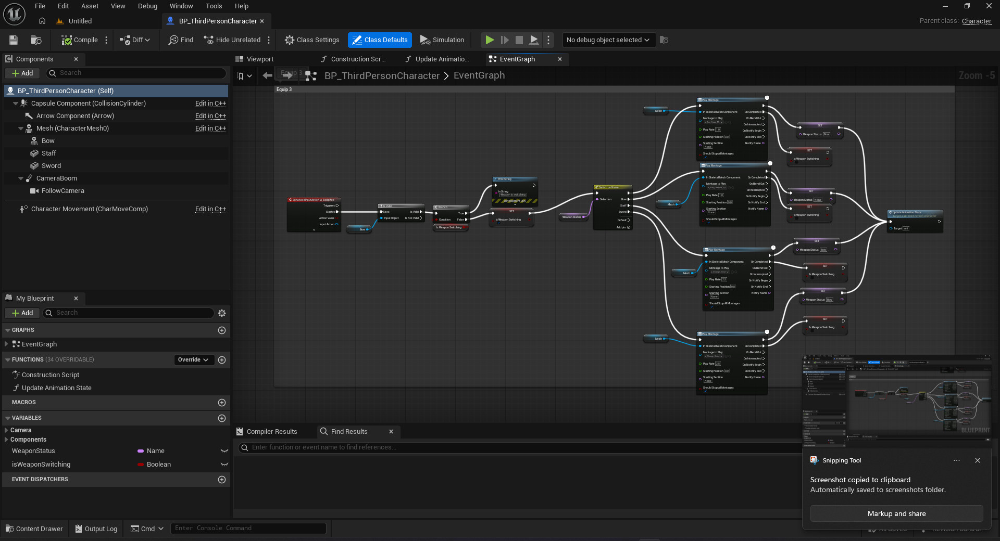
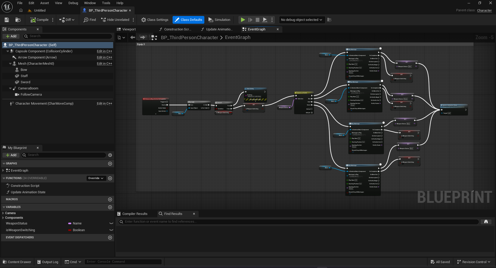
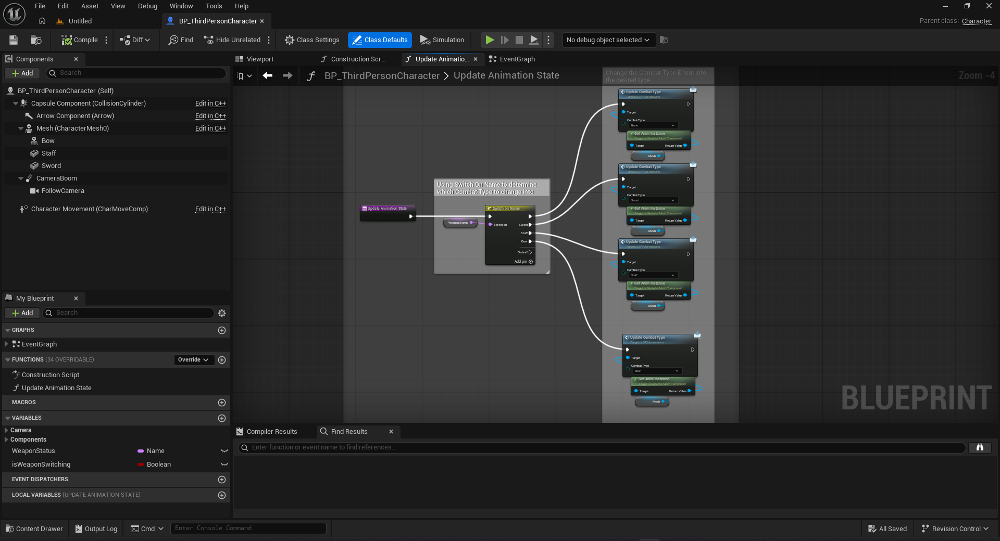
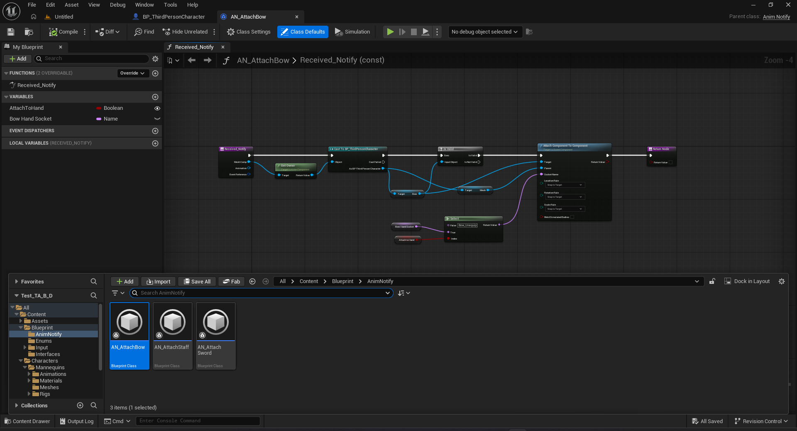
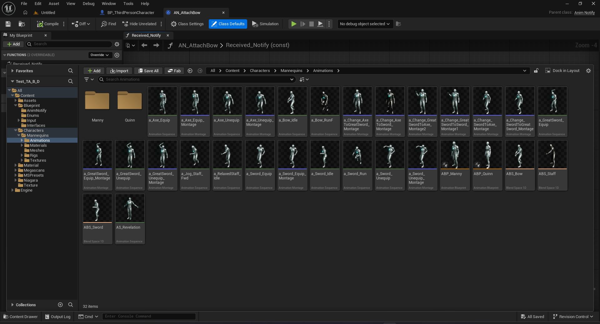
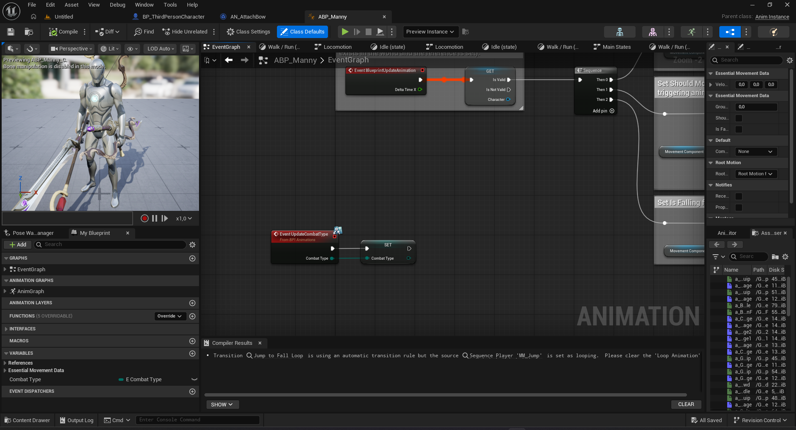
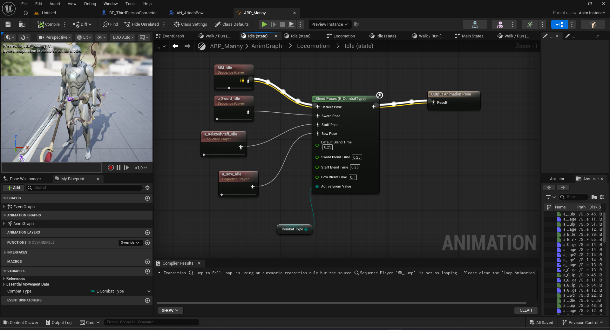
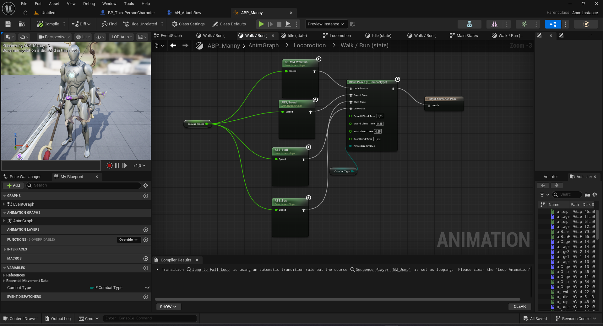

# Technical Artist Test - [Test B - Character Animation Tech]

**Candidate:** Lương Duy Tuấn Phong
**Test:** B - Character Animation Tech
**Completion Time:** 2.0 Man-Days
**UE Version:** 5.8

#🎯 Test Overview

- Xây dựng hệ thống nhân vật góc nhìn thứ ba với khả năng di chuyển, nhảy và chuyển đổi linh hoạt giữa ba loại vũ khí: Sword, Staff và Bow. BP_ThirdPersonCharacter đảm nhiệm xử lý input. ABP_Manny tổ chức locomotion thông qua State Machine kết hợp Blend Space, đồng thời lựa chọn animation phù hợp dựa trên E_CombatType; nhân vật kế thừa logic này qua Animation Blueprint ABP_Quinn.

  Các thách thức kỹ thuật chính được giải quyết trong thiết kế gồm:

  - Đồng bộ vũ khí với chuyển động: AN_AttachSword, AN_AttachStaff và AN_AttachBow đảm nhiệm việc chuyển vũ khí giữa socket trên tay và vị trí cất, được kích hoạt chính xác tại thời điểm Notify trong animation. Biến AttachToHand cho phép tái sử dụng cùng một Notify cho cả hai thao tác trang bị và cất vũ khí, giảm thiểu trùng lặp logic.

  - Phối hợp locomotion và thao tác trang bị: Montage sử dụng slot UpperBody, kết hợp với cấu trúc Layered Blend per Bone trong Animation Blueprint để phối trộn mượt mà giữa thao tác thân trên và chuyển động di chuyển của nhân vật.

  - Quản lý chuyển đổi trạng thái: CombatType, isWeaponSwitching cùng interface BPI_Animations phối hợp đồng bộ trạng thái giữa Character Blueprint và Animation Blueprint, đảm bảo kiểm soát chặt chẽ các yêu cầu đổi vũ khí và tránh xung đột trạng thái.

  - Tái sử dụng logic animation: Việc tách riêng điều khiển nhân vật, xử lý pose và sự kiện gắn vũ khí thành các thành phần độc lập giúp hệ thống dễ mở rộng, dễ bảo trì và thuận tiện khi chỉnh sửa về sau.

# 🚀 Key Features

- Feature 1 — Chuyển đổi và đồng bộ vũ khí với animation
Tôi dùng E_CombatType trong BP_ThirdPersonCharacter để quản lý 3 loại vũ khí Sword, Staff, Bow, phát Montage trang bị/cất vũ khí và cập nhật trạng thái qua BPI_Animations. Phần khó nhất là làm sao vũ khí đổi vị trí đúng lúc nhân vật đang thực hiện động tác — tôi xử lý bằng Notify AN_AttachSword/Staff/Bow, dùng biến AttachToHand để chọn socket rồi gọi AttachToComponent ngay tại thời điểm Notify.

- Feature 2 — Locomotion thay đổi theo vũ khí đang cầm
ABP_Manny dùng GroundSpeed, IsFalling, State Machine và Blend Space để xử lý đứng/đi/chạy/nhảy, còn Blend Poses by Enum giúp chọn đúng bộ animation theo vũ khí đang trang bị. Tôi để việc gắn vũ khí chạy tại Notify thay vì check mỗi frame để đỡ tốn hiệu năng hơn — phần này tôi vẫn cần profiling thêm khi có nhiều nhân vật cùng lúc để chắc chắn không bị nghẽn.

- Feature 3 — Tách lớp animation để dễ tái sử dụng
Tôi dùng slot UpperBody trong Montage kết hợp Layered Blend per Bone ở ABP_Manny để tách riêng thao tác tay trên và locomotion. Workflow tôi làm là đặt Notify trong Montage Editor, canh socket trong Skeleton Editor, rồi chỉnh transition trong Animation Blueprint Editor. ABP_Quinn kế thừa từ ABP_Manny nên khi cần đổi animation tôi chỉ việc dùng Asset Override Editor thay vì clone lại cả graph.

# 🎮 How to Test

1. Extract the project ZIP file.
2. Open the project using **Unreal Engine 5.8**.
3. Open and play the **TA_Test_B_D** level.
4. Implemented character movement 
5. Press 1, 2, and 3 to switch weapons.

# 📊 Performance Metrics 

- Target FPS: 60 
- Achieved: 60 fps 
- Frame: 16.40ms
- Mem: 4.27GB
- GPU Time: 4.7ms

# 🛠 Tools & Techniques Used
- UE5 Systems: Blueprint,  Materials, Control Rig, Animation Blueprints, Retargeting Animations

## 🎨 Media Preview

