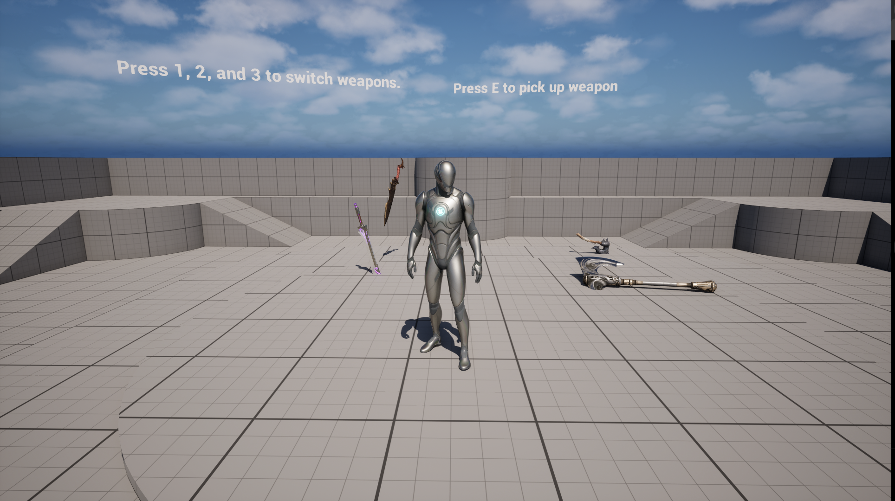
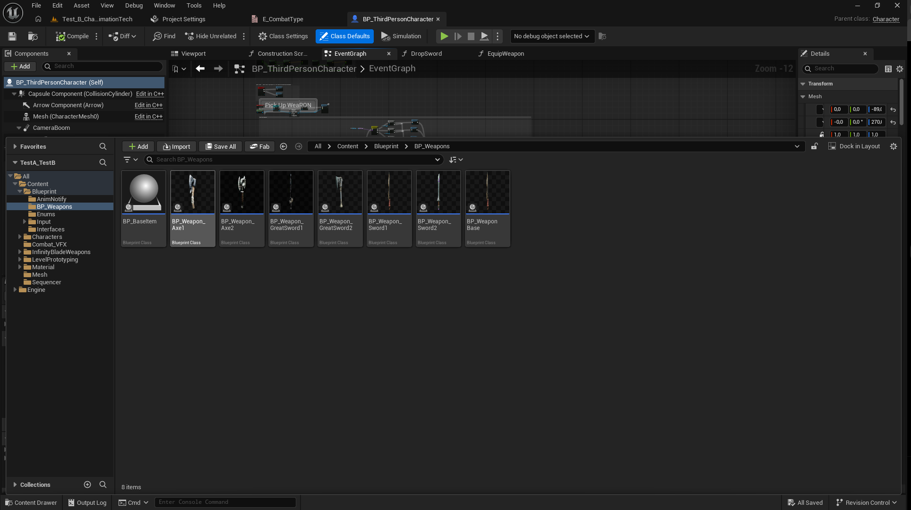
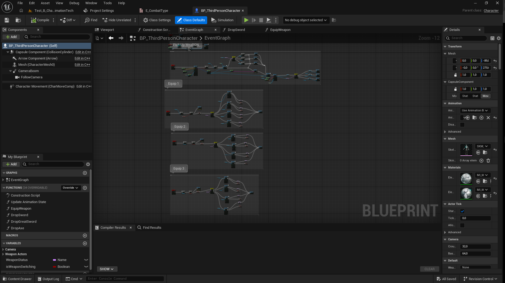
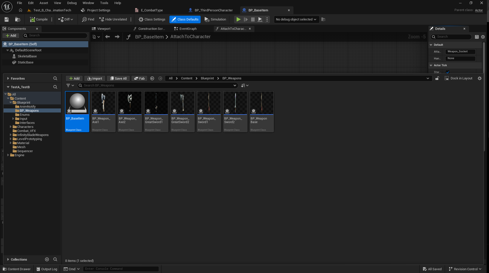
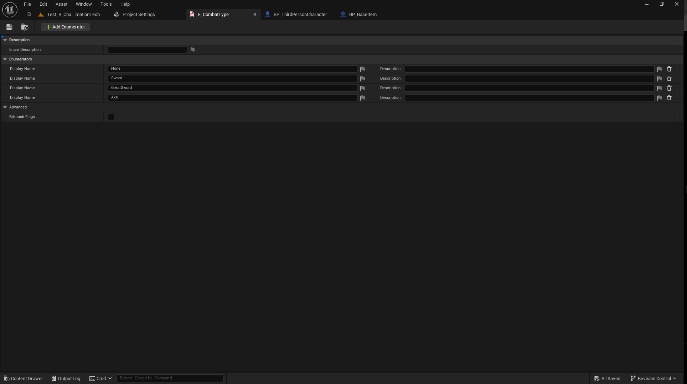
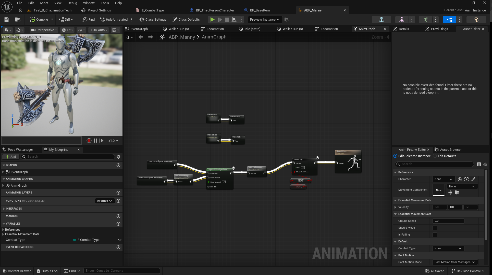
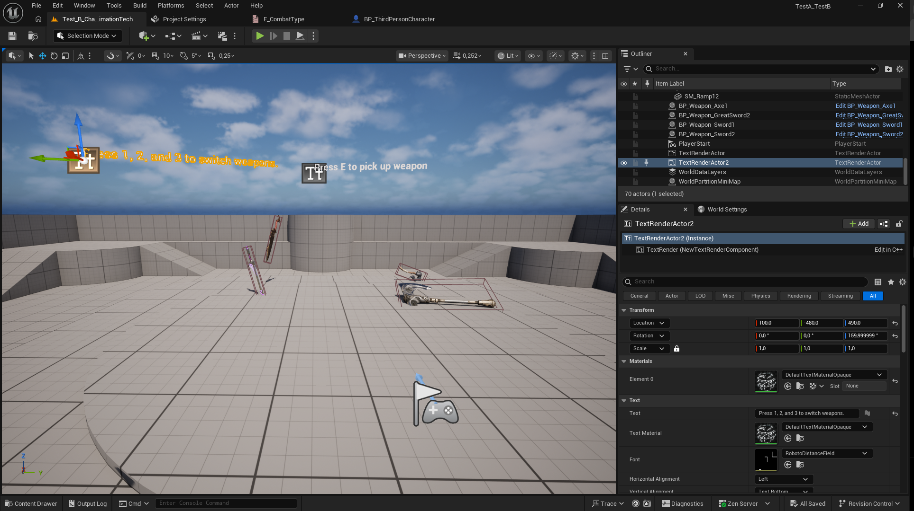
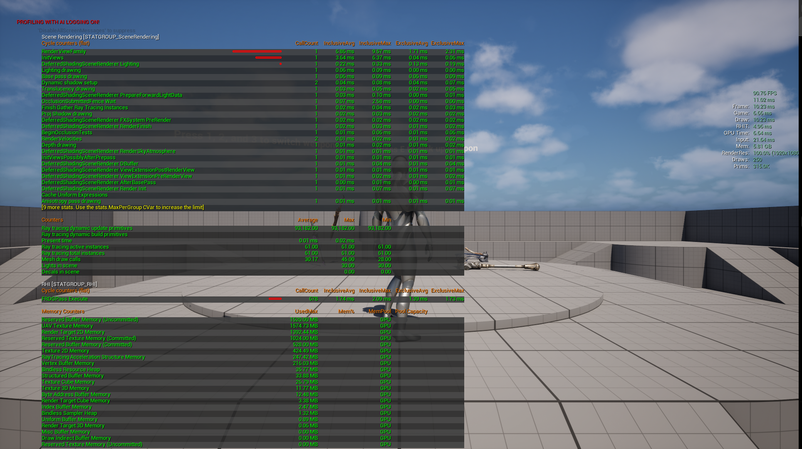

# Technical Artist Test - [Test B - Character Animation Tech]

**Candidate:** Lương Duy Tuấn Phong
**Test:** B - Character Animation Tech
**Completion Time:** 2.0 Man-Days
**UE Version:** 5.7

#🎯 Test Overview

A Procedural Weapon Attachment System for Unreal Engine 5, enabling characters to wield three different weapon types (Sword, GreatSword, Axe) with hands accurately gripping the weapon in real time, using an Animation Blueprint combined with Control Rig  and an auto-detecting socket system on the weapons.

# 🚀 Key Features

- Setting Up and Prep Work — configured the character skeleton, weapon sockets, and base Animation Blueprint structure needed before any grip logic could be implemented.
- Picking Up A Weapon — implemented overlap/trace detection to identify nearby weapon actors and attach them to the character's hand socket on interaction.
- Dropping The Sword — detach logic that removes the weapon from the hand socket and re-enables physics simulation so the weapon falls naturally into the world.
- Retargeting Animations — used UE's Retargeting Manager to share a single set of weapon animations across different character skeletons instead of duplicating clips per character.
- Equip and Unequip with Anim Montage — equip/unequip actions are driven through Anim Montages played on a dedicated slot, syncing the visual attach/detach moment to the correct animation frame.
- Pick Up More Weapon Types — extended the pickup/attach system to support multiple weapon categories (sword, staff, bow) beyond the initial single-weapon setup.
- Switching Weapons — added logic to swap the currently held weapon, updating the weapon type enum and re-targeting IK/grip sockets so the transition reflects the new weapon immediately.

# 🎮 How to Test

1. Extract the project ZIP file.
2. Open the project using **Unreal Engine 5.7**.
3. Open and play the **Test_B_CharacterAnimationTech** level.
4. Implemented character movement and weapon pickup.
5. Press E to pick up weapon
6. Press 1, 2, and 3 to switch weapons.

# 📊 Performance Metrics 

- Target FPS: 120 
- Achieved: 120 fps 
- Frame: 8.40ms
- Mem: 4.27GB
- GPU Time: 4.7ms

# 🛠 Tools & Techniques Used
- UE5 Systems: Blueprint,  Materials, Control Rig, Animation Blueprints, Retargeting Animations

## 🎨 Media Preview

